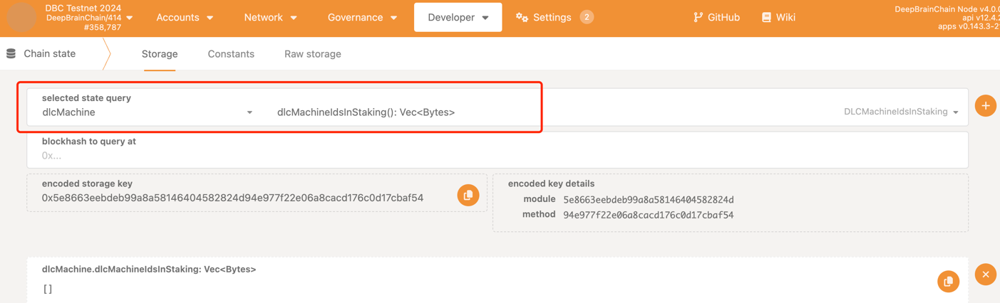
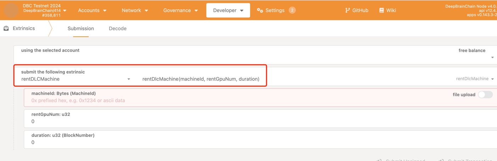

# 使用说明

## 矿工使用说明
测试网函数调用入口：
https://blockscout-testnet.dbcscan.io/address/0xd99B9dDD026D13886dbcc1bfBe7e8bb2195B1185?tab=write_proxy
测试网质押合约地址：0x5F953D181ED266a925245d26Cc252Ad937001815，
测试网DLC Token合约地址：0xd6a0843e7c99357ca5bA3525A0dB92F8E5817c07
### 质押
    1. 在DBC主网/测试网钱包租用自己提供的机器
    2. 在DBC主网evm/测试网evm上的DLC质押合约中 调用stake(..)函数
### 提取奖励
    1. 在DBC主网evm/测试网evm上的DLC质押合约中 调用claim(..)函数
### 取消质押
    1. 在DBC主网evm/测试网evm上的DLC质押合约中 调用unStakeAndClaim(..)函数
### 查询因被举报而被罚款的金额
    1. 在DBC主网evm/测试网evm上的DLC质押合约中 调用getLeftSlashedAmount(..)函数
### 查询可以提取的奖励金额
    1. 在DBC主网evm/测试网evm上的DLC质押合约中 调用getRewardAmountCanClaim(..)函数
### 查询机器是否处于质押状态
    1. 在DBC主网evm/测试网evm上的DLC质押合约中 调用isStaking(..)函数
### 查询质押DLC的金额
    1. 在DBC主网evm/测试网evm上的DLC质押合约中 调用stakeholder2Reserved(..)函数

## 用户使用说明
### 租用
    1. 在DBC主网/测试网钱包的dlcMachine模块的dlcMachineIdsInStaking函数查看可以租用的机器id

    2. 在rentDLCMachine模块的rentDlcMachine函数租用机器 并填入相关参数

### 举报
    1. 在DBC主网/测试网钱包的maintainCommittee模块的reportDlcMachineFault函数 并填入相关参数 在举报审核通过的两天后 会给举报 人提供的evm钱包地址转入举报奖励

